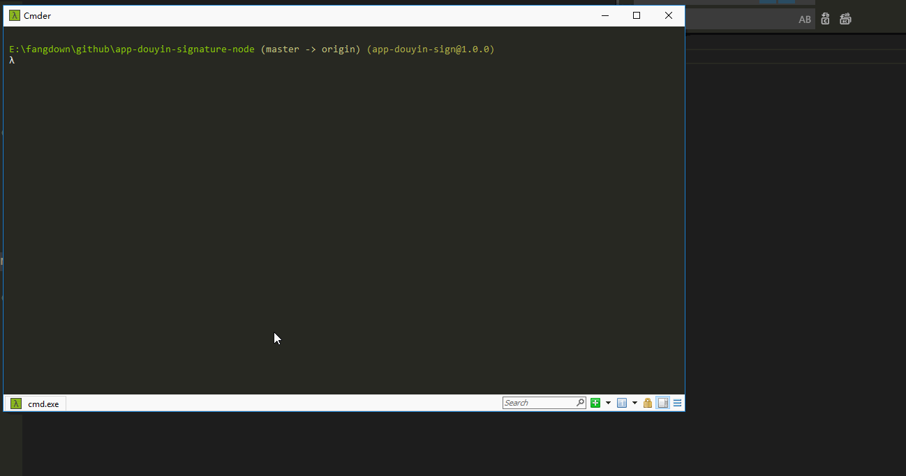

## 说明
本仓库只显示html运行签名效果
nodejs版本效果，暂时不开放

### 原理
1. 使用nodeJs 获取网页原始数据， 
2. 解析数据，获取tac、dytk
3. 根据tac生成签名
4. 根据signature, dytk, user_id等组装请求视频列表数据
5. 设置请求user-agent（需和1步骤中的user-agent保持一致）

> 前人栽树，后人乘凉， 喜欢的点个star吧！！！

### sign.html
在网页模式下，测试签名算法是否有效，
拿到签名后， 可以发起请求，注意user-agent要一致

